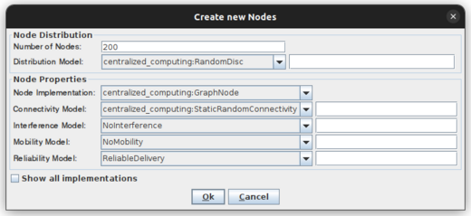
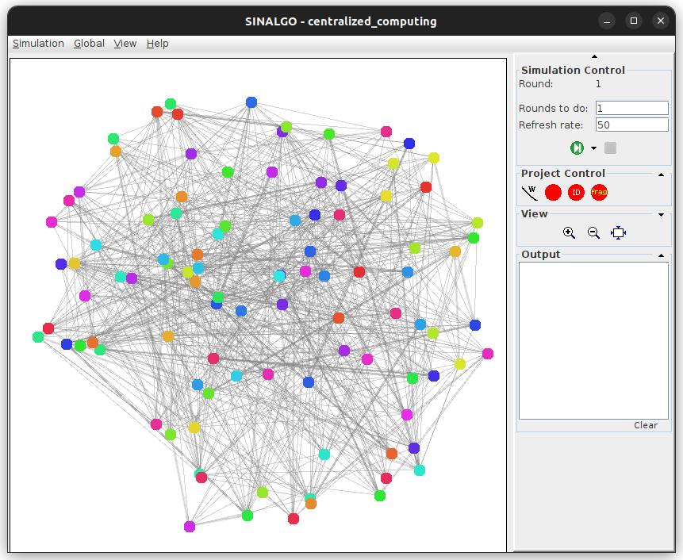
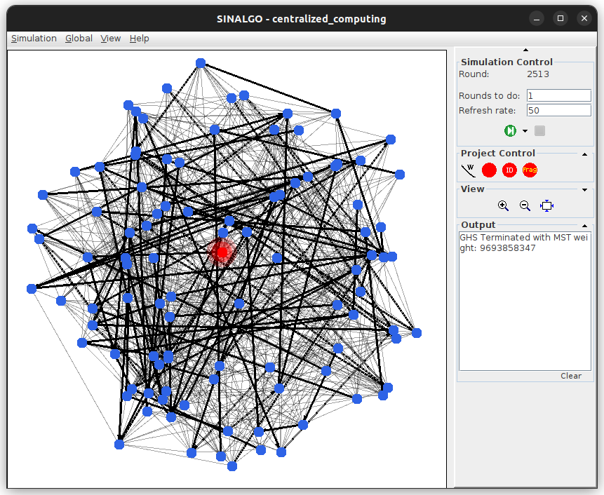

# msc-distributed-algorithms-project
Project for the M.Sc. course "22932 Distributed Algorithms for Communication Networks" of The Open University of Israel.

# setup
## using an IDE
Move the directory `centralized_computing` (inside `src`) to the projects folder of your Sinalgo installation (`src/projects/.`).
Then compile via the IDE.

## manual setup
Change to the `src` directory, edit the first line of the Makefile so that `SINALGO_DIRECTORY` is set to your Sinalgo installation path. Then run `make compile` to compile the project.

# usage
## initial configuration
Open Sinalgo and choose "centralized_computing" from the projects list.
Then, click on "Simulation" from the toolbar and choose "Generate Nodes". The following window will open:

Enter a number of nodes to generate, up to 500 nodes are recommended to not burden the visual panel.
Make sure all other fields (distribution model and all node properties) are set as in the above example.
Then, execute a single round of the simulation in order for all the node connections to be evaluated.
The graph will now look like this:

## GHS algorithm 
Running the simulation from this point will perform the GHS algorithm to compute a minimum spanning tree (MST) of the graph.
It is recommended to moderate the refresh rate since principal visual changes occur at the granularity of phases and not individual rounds, thus the default refresh rate (1) will serve only to slow down the simulation significantly while providing marginal visual enhancement. A sensible value for example is a refresh rate of 50 for a 200 node graph.

The nodes are colored by fragment association, notice that with each phase - the number of different colors decrease appropriately as clusters merge together. At the end of the algorithm all nodes are colored blue, tree edges black and other edges a faint gray.

## server-client communication 
After completion of the GHS algorithm, the user may choose a node to be declared 'server' and another node to communicate with it.
To select a node as the server, make sure GHS terminated, i.e. all nodes are blue and edges black/gray.
Right click the node and choose "Set as Server". The chosen node will be highlighted red:

Now, run the simulation again until termination - during these rounds the new server will propagate the message and a subset of edges will be inverted such that it becomes the new root, that is, all paths in the tree point to it.
Afterwards, to send a message from an arbitrary node to the server - right click a node and choose "Send Message to Server", running the simulation then will highlight the traversed edges in bold red as the message travels to and from the server, along the computed MST.
